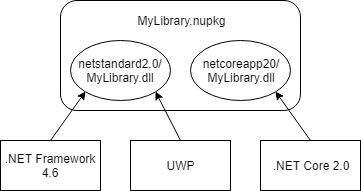

# Cross-platform Targeting

The modern .NET ecosystem supports multiple operating systems and devices. It is important for .NET OSS projects to support as wide a range of developers as possible, whether they are building an ASP.NET website hosted in Azure, or a .NET game in Unity.

There are two main ways to add cross-platform support to a .NET library:

1. Target .NET implementations individually and include multiple assemblies in a NuGet package. This leverages NuGet's ability to have multiple assemblies in a package and select the best one when added to an application.
2. Target .NET Standard, a specification for .NET APIs available on all .NET implementations. The single .NET Standard assembly supports multiple .NET implementations. A great benefit of .NET Standard is new .NET implementations will automatically be supported by your library without any modification.

You can also combine these two approaches. For example a `netstandard2.0` target could be the default implementation and you could provide a .NET implementation specific target that uses implementation specific APIs for additional features. NuGet will automatically select the implementation specific target when possible, e.g. a .NET Core application will use the `netcoreapp2.0` assembly over the `netstandard2.0` assembly.



**✓ DO** use a modern .NET Class Library together with the `TargetFrameworks` if you want to build multiple targets.

```xml
<Project Sdk="Microsoft.NET.Sdk">
  <PropertyGroup>
    <!-- This project will output netstandard2.0 and netstandard1.0 assemblies -->
    <TargetFrameworks>netstandard2.0;netstandard1.0</TargetFrameworks>
  </PropertyGroup>
</Project>
```

**✗ AVOID** targeting .NET implementations and .NET Standard when the .NET implementation is functionally the same.

> The .NET Standard assembly will automatically be used by NuGet. Targeting .NET implementations increases the `*.nupkg` size for no benefit.

**More Information**

* [.NET target frameworks](https://docs.microsoft.com/en-us/dotnet/standard/frameworks)
* [Multi-Targeting and Porting a .NET Library to .NET Core 2.0](https://weblog.west-wind.com/posts/2017/Jun/22/MultiTargeting-and-Porting-a-NET-Library-to-NET-Core-20)

## .NET Standard

The .NET Standard is a specification of .NET APIs that are available on all .NET implementations. Targeting a .NET Standard lets you produce a library that is usable by all platforms that support that version of .NET Standard.


Note that targeting .NET Standard, and successfully compiling your project, does not guarantee the library will run successfully on all platforms:

1. Platform specific APIs will fail on other platforms, e.g. `Microsoft.Win32.Registry` will succeed on Windows and throw `PlatformNotSupportedException` when used on any other OS.
2. APIs can behave differently, e.g. reflection APIs have different performance characteristics when an application uses ahead-of-time compilation on iOS or UWP.

**✓ CONSIDER** including a `netstandard2.0` target.

> .NET Standard 2.0 is supported by all modern platforms and is the recommended way to support multiple platforms with one target.

**✗ AVOID** including a `netstandard1.x` target.

> A .NET Standard 1.x target has a large package dependency graph and will download a lot of packages. Modern .NET platforms, including .NET Framework 4.6.1, UWP and Xamarin, all support .NET Standard 2.0. You should only target .NET Standard 1.x if you specifically need to target an older platform.
>
> If you do have a 1.x target then also include a 2.0 target. Modern platforms will use the 2.0 target and older platforms will fallback to 1.x.

**✗ DO NOT** include a .NET Standard target if the library relies on a platform specific app model.

> For example a UWP control toolkit library depends on an app model that is only available on UWP. App model specific APIs will not be not available in .NET Standard.

**More Information**

* [.NET Standard](https://docs.microsoft.com/en-us/dotnet/standard/net-standard)

## Older Targets

.NET supports targeting versions of the .NET Framework that are long out of support, e.g. .NET 2.0, as well as platforms that are no longer commonly used, e.g. Silverlight and Windows Phone. The value of targeting such old platforms can be easily outweighed by the overhead of programming around missing APIs.

**✗ DO NOT** include a Portable Class Library (PCL) target, e.g. `portable-net45+win8+wpa81+wp8`.

> .NET Standard is the modern way to support cross-platform .NET libraries and replace PCLs.

**✗ DO NOT** include targets for .NET platforms that are no longer supported, e.g. `SL4`, `WP`.

---

[Home](./README.md)