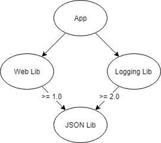

# Dependencies

The primary way of adding dependencies to a .NET library is referencing NuGet packages. NuGet package references allow you to quickly reuse and leverage already written functionality but they are also a common source of friction for .NET developers. Correctly managing dependencies is important to prevent changes in other .NET libraries breaking your .NET library, and vice versa!

## Diamond Dependencies

It is a common situation for a .NET project to have multiple versions of a package in its dependency tree. For example an app depends on two NuGet packages, each of which depends on different versions of the same package. This is known as a diamond dependency.



At build time NuGet analyzes all the packages a project depends on (including the dependencies of dependencies) and when multiple versions of a package is detected a set of rules are evaluated to pick one. Unifying packages is necessary because of the issues in .NET with running side by side versions of an assembly.

Most diamond dependencies are resolved without issue, however they can create issues in certain circumstances:

1. **Conflicting NuGet package references** prevent a version being resolved during package restore.
2. **Breaking changes** between the versions cause bugs and exceptions at runtime.
3. The package assembly is **strong named**, the assembly version changed, and the app is running on the .NET Framework. Assembly binding redirects are required.

It is impossible to know what packages will be used alongside your own, but you can reduce the likelihood of a diamond dependency causing your OSS project to break by minimizing the number of packages you depend on.

**✓ DO** review your .NET library for unnecessary dependencies.

## NuGet dependency version ranges

A package reference specifies the range of valid packages it allows. Typically the package reference version in the `csproj` file is the minimum version and there is no maximum.

```xml
<!-- Accepts any version 1.0 and above. -->
<PackageReference Include="ExamplePackage" Version="1.0" />
```

The rules that NuGet uses when resolving dependencies are [complex](https://docs.microsoft.com/en-us/nuget/consume-packages/dependency-resolution), but one of the rules is NuGet attempts to find the lowest applicable version. NuGet prefers the lowest application version over using the highest available because the lowest will have the least compatibility issues.

Because of NuGet's lowest application version rule it is not necessary to place an upper version or exact range on package references to avoid getting the latest version. NuGet already tries to find the lowest, most compatible version for you.

```xml
<!-- Accepts 1.0 up to 1.x, but not 2.0 and higher. -->
<PackageReference Include="ExamplePackage" Version="[1.0,2.0)" />

<!-- Accepts exactly 1.0. -->
<PackageReference Include="ExamplePackage" Version="[1.0]" />
```

Upper version limits will cause NuGet to fail if there is a conflict, e.g. one library accepts exactly 1.0 while another library requires 2.0 or above. While breaking changes may have been introduced in version 2.0, a strict or upper limit version dependency guarantees an error.


**X DO NOT** have package references with no minimum version.

**X AVOID** having package references demanding an exact version.

**X AVOID** having package references with a version upper limit.

---

[Home](./README.md)