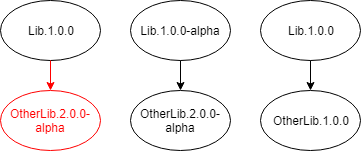

# NuGet

NuGet is a package manager for the .NET eco-system and is the primary way that .NET OSS projects are discovered and acquired by developers. NuGet packages are generally hosted on nuget.org, a free service provided by Microsoft for hosting NuGet packages, but you can publish to custom NuGet services like MyGet and VSTS Package Service.


## Creating a NuGet Package

A NuGet package (`*.nupkg`) is basically a zip file containing .NET assemblies and associated metadata.

There are two main ways to create a NuGet package. The newer and recommended way is to create a package from a modern .NET Class Library (a modern .NET Class Library `csproj`/`vbproj` file starts with `<Project Sdk="Microsoft.NET.Sdk">`). Assemblies and targets are automatically added to the package and remaining metadata, e.g. package name and version number, is added to the MSBuild file. Compiling with the `pack` command outputs a `*.nupkg` file instead of assemblies.

```xml
<Project Sdk="Microsoft.NET.Sdk">
  <PropertyGroup>
    <TargetFramework>netstandard2.0</TargetFramework>
    <AssemblyName>Contoso.Api</AssemblyName>
    <PackageVersion>1.1.0</PackageVersion>
    <Authors>John Doe</Authors>
  </PropertyGroup>
</Project>
```

The older way of creating a NuGet package is with a nuspec file and the `nuget.exe` command line tool. A nuspec file gives you a lot of control but you must carefully specify what assemblies and targets to include in the final NuGet package, and it is easy to make a mistake or for someone to forget to update the nuspec when making changes. The advantage of a nuspec is you can use it create NuGet packages with projects that do no yet support modern .NET Class Libraries.

```xml
<?xml version="1.0" encoding="utf-8"?>
<package xmlns="http://schemas.microsoft.com/packaging/2010/07/nuspec.xsd">
    <metadata>
        <id>Contoso.Api</id>
        <version>1.1.0</version>
        <description></description>
        <authors>John Doe</authors>
    </metadata>
    <files>
        <file src="bin\Release\netstandard2.0\*.dll" target="netstandard2.0" />
    </files>
</package>
```

**✓ CONSIDER** using a modern .NET Class Library to create a NuGet package if possible.

**✓ CONSIDER** setting up SourceLink to add source control metadata to your assemblies and NuGet package.

**More Information**

* [Creating NuGet packages](https://docs.microsoft.com/en-us/nuget/create-packages/creating-a-package)
* [Migrate from packages.config to PackageReference
](https://docs.microsoft.com/en-us/nuget/reference/migrate-packages-config-to-package-reference)

### Package Dependences

NuGet package dependencies are covered [here](./dependencies.md).

### Important NuGet Package Metadata

A NuGet package has a lot of associated metadata. This is the metadata that every project should provide:

| MSBuild Property name            | Nuspec name              | Description  |
| -------------------------------- | ------------------------ | ------------ |
| PackageId                        | id                       | The package identifier. Prefix can be reserved if it meets the [criteria](https://docs.microsoft.com/en-us/nuget/reference/id-prefix-reservation) |
| PackageVersion                   | version                  | NuGet package version. Read more about it [here](./versioning.md#NuGet-Package-Version).             |
| Title                            | title                    | A human-friendly title of the package. It defaults to the `PackageId`.             |
| Description                      | description              | A long description of the package displayed in UI.             |
| Authors                          | authors                  | A comma-separated list of packages authors, matching the profile names on nuget.org.             |
| PackageTags                      | tags                     | A space-delimited list of tags and keywords that describe the package. These are used when searching for packages.             |
| PackageIconUrl                   | iconUrl                  | A URL for an image to use as the icon for the package. URL should be HTTPS and the image should be 64x64 and have a transparent background.             |
| PackageProjectUrl                | projectUrl               | A URL for the project homepage or source repository.             |
| PackageLicenseUrl                | licenseUrl               | A URL to the project license. Can be the URL to the `LICENSE` file in source control.             |

**✓ CONSIDER** choosing a NuGet package name with a prefix that meets NuGet's prefix reservation [criteria](https://docs.microsoft.com/en-us/nuget/reference/id-prefix-reservation).

**✓ CONSIDER** using the `LICENSE` file in source control as the `LicenseUrl`, e.g. https://github.com/JamesNK/Newtonsoft.Json/blob/master/LICENSE.md

**✓ DO** use a HTTPS href to your package icon.

> Sites like nuget.org run with HTTPS enabled and displaying a non-HTTPS image will create a mixed content warning.

**✓ DO** use a package icon image that is 64x64 and has a transparent background for best viewing results.

**More Information**

* [.nuspec reference](https://docs.microsoft.com/en-us/nuget/reference/nuspec)

### Pre-release Packages

NuGet packages with a version suffix are considered pre-release. By default the NuGet Package Manager UI shows stable releases unless a user opts-in to pre-release packages, making pre-release packages ideal for limited user testing.

```xml
<PackageVersion>1.0.1-beta1</PackageVersion>
```

Note that a stable package cannot depend on a pre-release package. You must either make your own package pre-release, or depend on an older stable version.



**✓ DO** publish a pre-release package when testing, previewing, or experimenting.

**✓ DO** publish a stable package when it is ready so other stable packages can reference it.

**More Information**

* [Building pre-release packages](https://docs.microsoft.com/en-us/nuget/create-packages/prerelease-packages)

### Symbol Packages

NuGet supports generating a separate symbol package containing debug PDB files along side the main package containing .NET assemblies. The idea of symbol packages is they are hosted on a symbol server and are only downloaded by a tool like Visual Studio on demand.

Currently the main public host for symbols - [SymbolSource](http://www.symbolsource.org/) - does not support the portable PDBs created by modern .NET Class Libraries and symbol packages are not generally useful.

**✓ CONSIDER** embedding PDBs in the main NuGet package.

**✗ AVOID** creating a symbols package containing PDBs.

**More Information**

* [Creating symbol packages](https://docs.microsoft.com/en-us/nuget/create-packages/symbol-packages)

---

[Home](./README.md)