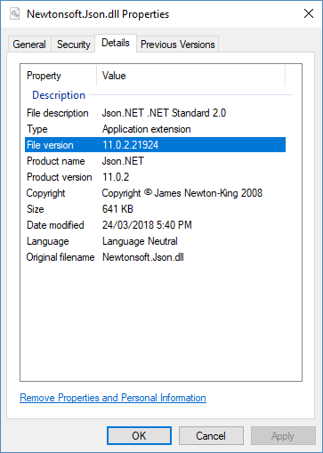

# Versioning

## Version Numbers

A .NET library has many ways to specify a version. These are the most important:

### NuGet Package Version

The NuGet package version is what is displayed on nuget.org, the Visual Studio NuGet UI, and is written to `package.config`/`*.csproj` when the packaged is used. This version number is what users will commonly see and to refer to when they think and talk about the version of a library they are using. The NuGet package version is used by NuGet and has no effect on runtime behavour.

The NuGet package version is set with `PackageVersion` in a `*.csproj` file and has the form `Major.Minor.Patch[-Suffix]`. The NuGet package identifier, e.g. Newtonsoft.Json, combined with the NuGet package version, e.g. 11.0.2, is used to uniquely identify a package in NuGet.

A NuGet package with a pre-release suffix in the version has special behavior. Read about pre-release NuGet packages [here](./nuget.md#prerelease).

Note that nuget.org does not allow a package to have duplicate versions and does not allow a package to be deleted after it has been published. If you make a mistake you will need to unlist the incorrect package, increment the version number and publish a new version.

**✓ CONSIDER** using [SemVer](https://semver.org/) to version your NuGet package

**✓ DO** use the NuGet package version number in public communication and documentation as it is the version number that users will commonly see

**✓ DO** include a suffix in the version for pre-release package versions. Users must opt-in to getting pre-release packages so understand that the package is not complete

More info - https://docs.microsoft.com/en-us/nuget/reference/package-versioning

### Assembly Version

The assembly version is what the CLR uses at runtime to select which version of an assembly to load. Selecting an assembly using versioning only applies to assemblies with a strong name.

The assembly version is set with the `AssemblyVersion` property in you are using an SDK project, or `AssemblyVersionAttribute` in `AssemblyInfo.cs`, and has the form `Major.Minor.Build.Revision`.

By default, the Windows .NET Framework CLR demands an exact match when loading a strong named assembly, e.g. Libary1 was compiled with a reference to Newtonsoft.Json 11.0.0 and will only load that exact version. To load a different version at runtime a binding redirect must be added to the .NET application's config file.

Strong naming combined with assembly version is a controversial subject. While strong naming a library has a number of benefits, it often results in runtime exceptions that an assembly can't be found and [requires binding redirects](https://docs.microsoft.com/en-us/dotnet/framework/configure-apps/redirect-assembly-versions) in `app.config`/`web.config` to be fixed. .NET Core assembly loading has been relaxed, and the .NET Core CLR will automatically load assemblies at runtime with a higher version.

**✓ CONSIDER** only including a major version in the AssemblyVersion, e.g. Library 1.0 and Library 1.0.1 both have an AssemblyVersion of `1.0.0.0`, while Library 2.0 has AssemblyVersion of `2.0.0.0`. The assembly version changing less often reduces binding redirects.

**X DO NOT** have a fixed AssemblyVersion. While a single AssemblyVersion avoids the need for binding redirects, it means that only a single version of the assembly can be GACed, and applications that reference the assembly in the GAC will break if another application updates the GACed assembly with breaking changes.

More info - https://docs.microsoft.com/en-us/dotnet/framework/app-domains/assembly-versioning

### Assembly File Version

The assembly file version is used to display a file version in Windows and has no effect on runtime behavior. It is visible in a file's Properties dialog in Windows Explorers.

The assembly file version is set with the `FileVersion` property if you are using an SDK project, or `AssemblyFileVersionAttribute` in `AssemblyInfo.cs`, and has the form `Major.Minor.Build.Revision`. Setting this version is optional.

**✓ CONSIDER** including the a continious integration build number as AssemblyFileVersion revision, e.g. you are building version 1.0.0 of your project, and the continuous integration build number is 99 so your AssemblyFileVersion is 1.0.0.99.

### Assembly Informational Version

The assembly informational version is used to record additional version information and has no effect on runtime behavior. If you are using SourceLink this version will automatically be included on build to contain the NuGet package version plus a source control version, e.g. the git commit hash the assembly was built from.

The assembly informational version is set with the `AssemblyInformationalVersion` property if you are using an SDK project, or `AssemblyInformationalVersionAttribute` in `AssemblyInfo.cs`, and it can have any form. Note that an innocuous build warning is raised if this version does not follow the format `Major.Minor.Build.Revision`. The warning can be safely ignored. Setting this version is optional.

**X AVOID** setting the assembly informational version yourself. Allow SourceLink to automatically generate it for you with NuGet plus source control metadata.

Read more about SourceLink here - SOURCELINK!